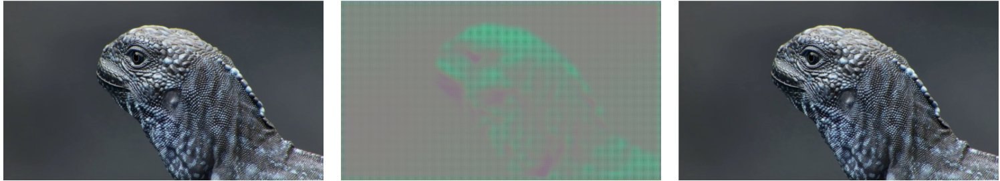
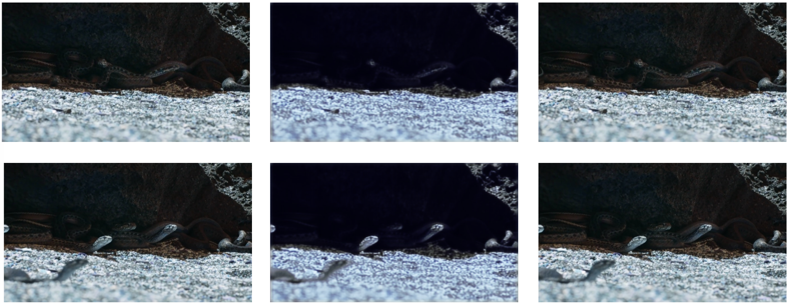

# Predictive Frame Inference (PIF) Model

## License
PIF-Model is licensed under **Apache Software License, Version 2.0**.

## Authors
* Chidera Biringa [biringachidera@gmail.com]
* Josue N Rivera [josue.n.rivera@outlook.com]
* Russell Thompson [rjsemail22@gmail.com]

## Installation
```
$ git clone https://github.com/biringaChi/PIF-Model
$ sudo pip3 install -r requirements.txt
```
## Description
In this project, we built an AI model that could infer a new frame between two existing sequential frames of a video
We trained a GAN neural network framework using youtube footage to predict it’s own existing frames The model which was created was able to infer new frames from high definition videos

## Methodology
* Model
	*  Trained using GAN
	* Convolutional Neural Network Model with multiple input
	* Images are encoded and decoded
    
	<p align="center"></p>
    
* Tools / Resources
    * PyTorch was used to build the models
    * Royalty-free videos was collected from Youtube

* Performance Measure
    * Pixels distance was used as a potential loss for the generator and metric to measure difference
    * BSE was used as the loss for the model
    

* Dataset
	* Videos was split into subset of 3 continuous frames
	* The model will be trained to predict the current frame by using the previous and next frame in the video
	* The model was able to generate new frames from the data distribution
	* Stitching technique was implemented to build the videos
    
## Run Sample
```
$ cd data_prep/
$ python3 data_sample.py
```
<p align="center"></p>
32 samples from dataset

* Scene Detection
    * Contiguous frame sequences were used by comparing the difference each scene to the next using
    * The spikes indicate transitions or new scenes. These were used as markers to tell the model where not to infer new frames

## Results
Run Model

```
$ cd inference/
$ python3 infer.py
```
<p align="center"></p> 
Inferred Frames from Model

* Generator and discriminator in a GAN model cause severe loss when creating new frames
* Theorized backpropagation through the generator and discriminator was causing information to be lost. 
* The model was modified to exclude the discriminator and only back propagate the generator

Inferred Sequences from new Model
<p align="center"></p>

Inferred Video Sequence
<video src="readme/inferred_seq.mp4" poster="readme/inferred_seq.png" width="100%" controls preload></video>

## Performance
<p align="center"></p>
Video Frames Difference

* The predominant difference between the original video frames and the generated is in the pixel intensity distribution
* We captured the overall objects and structure of the frames
