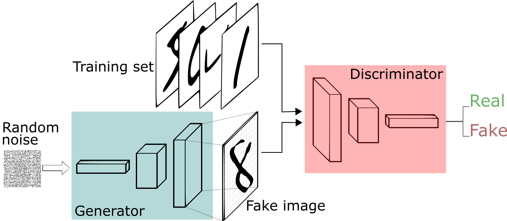
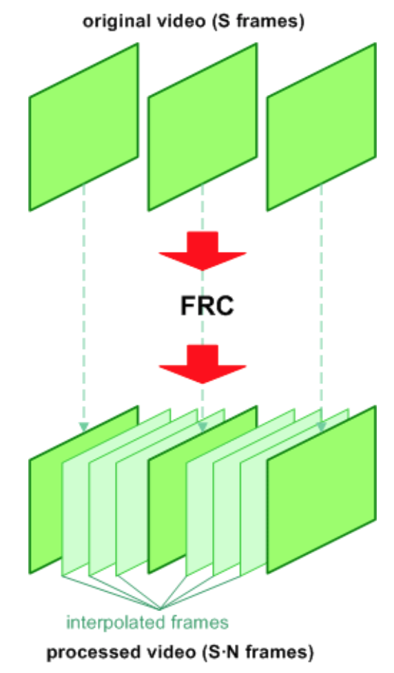
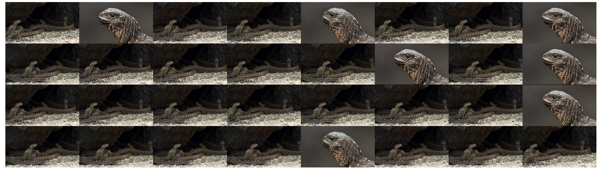
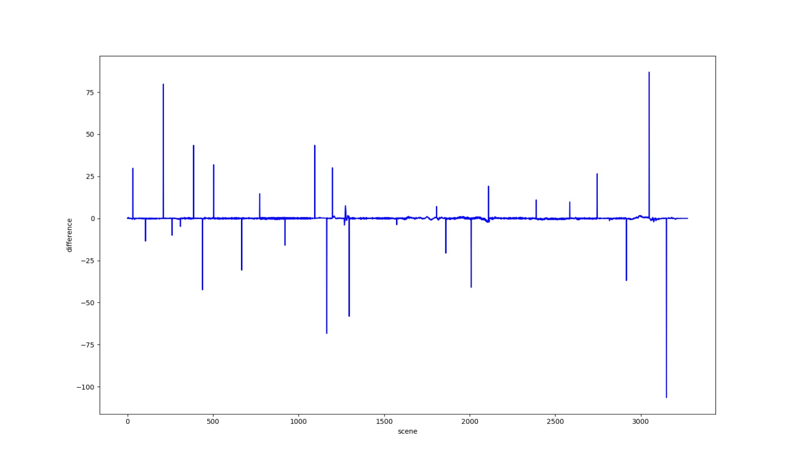
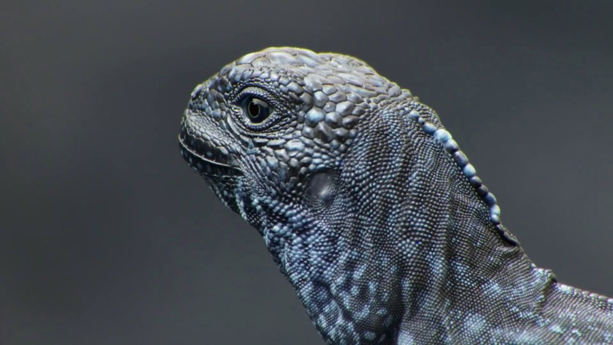
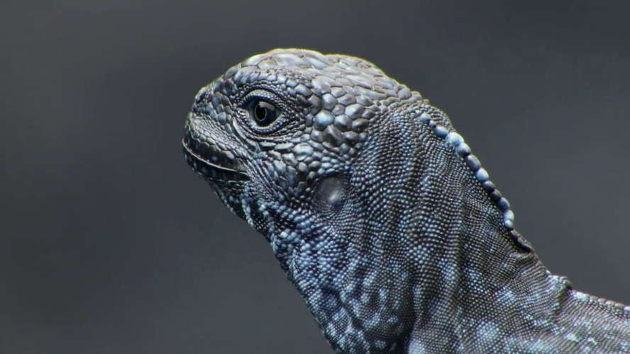

# Predictive Frame Inference (PIF) Model

## License
PIF-Model is licensed under **Apache Software License, Version 2.0**.

## Description
In this project, we built an AI model that could infer a new frame between two existing sequential frames of a video.
We trained a GAN neural network framework using youtube footage to predict it’s own existing frames. The model which was created was able to infer new frames from high definition videos.

## Methodology
* Model
	*  Trained using GAN
	* Convolutional Neural Network Model with multiple input
	* Images are encoded and decoded
    
	<p align="center"></p>
    
* Tools / Resources
    * PyTorch was used to build the models
    * Royalty-free videos was collected from Youtube

* Performance Measure
    * Pixels distance was used as a potential loss for the generator and metric to measure difference
    * BSE was used as the loss for the model
    
    <p align="center"></p>
    

* Dataset
	* Videos was split into subset of 3 continuous frames
	* The model will be trained to predict the current frame by using the previous and next frame in the video
	* The model was able to generate new frames from the data distribution
	* Stitching technique was implemented to build the videos
    
## Run Sample
```
python data_sample.py
```
<p align="center"></p>
32 samples from dataset

* Scene Detection
    * Contiguous frame sequences were used by comparing the difference each scene to the next using.
    * The spikes indicate transitions or new scenes. These were used as markers to tell the model where not to infer new frames.
<p align="center"></p>
Detected scenes

## Results
  
Infered Frames from GAN Model
